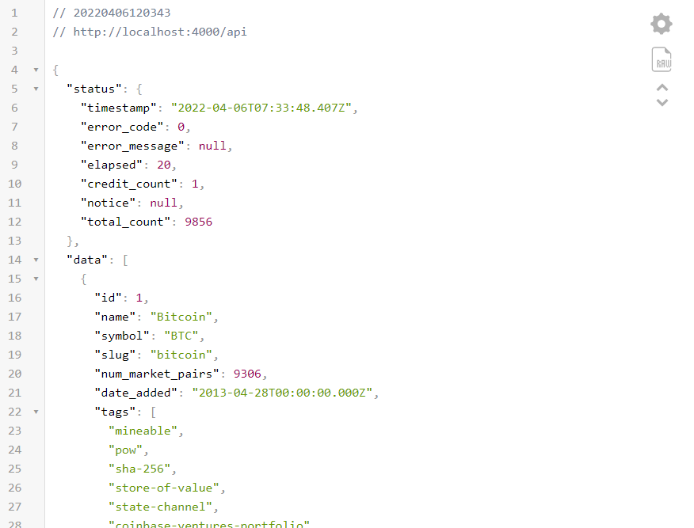

# building a real-time cryptocurrency info table with MUI(material-ui) and coinmarket cap API

we are going to build a real-time crypto table that is responsive and would show lots of information about every cryptocurrency using the coinmarket cap `API`.we are going to build a simple express backend to fetch the information from coinmarket cap and fetch them on a specific time interval avoiding too many API calls

Table of contents:

- [prepration](#prepration)

  - [backend](#backend)
  - [frontend](#frontend)
  - [API key](#api-key)

- [building the backend](#backend)

- [building the frontend](#frontend)

## preparation

make a folder and call it `crypto-table` open your terminal and run the commands:
Powershell:

```powershell
mkdir crypto-table;cd crypto-table;code .
```

bash:

```bash
mkdir cypto-table && cd crypto-table && code .
```

that would make a folder and open the vscode

### frontend

inside the `crypto-table` folder open a terminal and install React with CRA:

```bash
npx create-react-app frontend
```

open the src folder and delete everything inside this folder except `index.js`.
now `cd` into the `frontend` folder and install `@mui`:

```bash
npm install @mui/material @emotion/styled @emotion/react
```

emotion packages are necessary for `mui`

### backend

our express backend will be a simple server just to fetch data from the coinmarket cap `API`.head over to the root folder(`crypto-table`)and make a folder names `backend`.inside this folder open a terminal and install `express` and `axios`:

```bash
npm install express nodemon axios dotenv
```

now we have installed the packages we need to build the project you should have a folder structure like this:

```dir
|-- crypto-table
|   |-- backend
|   |-- frontend
        |-- public
        |-- src
            |-- index.js
        |-- .gitignre
        |-- package-lock.json
        |-- package.json
        |-- README.md

```

### API key

visit the [coinmarketcap](https://coinmarketcap.com/api/) website:


hit the `GET YOUR API KEY NOW` button. sign up on the website and you need to verify your email. after finish signing up and confirming your email address it will redirect you to your account page
if you didn't redirect to the account page visit this [link](https://coinmarketcap.com/api/) and login.

.png>)
(it has a generous free plan with 333 calls a day)

when you move the mouse over the API key section it shows a button that copies the key to the clipboard. now you are all good to go to the next section

## building the backend

inside the `backend` folder make two files: `server.js` and `.env`.
open the `.env` file, make a variable and paste your API key like so:

```env
COINMARKETCAP_API='(your_api_key)'
```

now let's build our express server.
import express and make a simple server that listens on port `4000`:

```js
reuqire('dotenv').config();
const express = require('express');
const app = express();
app.use(express.json());
app.get('/', (req, res) => {
  res.send('GET REQUEST');
});

app.listen(400, () => {
  console.log('server is running');
});
```

on terminal cd inside backend and type:

```bash
nodemon server.js
```

checkout `localhost:4000` you should see a text on the screen that says `GET REQUEST`
(PIC OF THE GET REQUEST)

the [coinmarket cap documentions](https://coinmarketcap.com/api/documentation/v1/) has lots of information on different endpoints. we'll use
the `v1/cryptocurrency/listing/lastest` endpoint, it returns a list sorted based on the highest `market_cap`.basically it is the same listing order on their front page.
create an instance of `axios` with `basicURL` and your API key.

```js
const api = axios.create({
  method: 'GET',
  baseURL: 'https://pro-api.coinmarketcap.com/v1/cryptocurrency',
  headers: {
    'X-CMC_PRO_API_KEY': process.env.COINMARKETCAP_API_KEY,
    Accept: 'application/json',
    'Accept-Encoding': 'deflate, gzip',
  },
});
```

the `X-CMC_PRO_API_KEY` header is what coinmarketcap needs for the authentication.
set the route as `/api`.now call the API inside the `get` request

```js
app.get('/api', (req, res) => {
  api('/listings/latest?limit=20')
    .then(value => value.data)
    .then(data => {
      res.json(data);
    });
});
```

visit the `localhost:4000` you should see a list of cryptocurrencies


(I am using the `json-viewer` extension. this is the [link](https://chrome.google.com/webstore/detail/json-viewer/gbmdgpbipfallnflgajpaliibnhdgobh) you can download the extension from webstore.)

now we have all we need on the server-side. your `server.js` code should look like this:

```js
require('dotenv').config();
const express = require('express');
const axios = require('axios').default;
const app = express();
app.use(express.json());

const api = axios.create({
  method: 'GET',
  baseURL: 'https://pro-api.coinmarketcap.com/',
  headers: {
    'X-CMC_PRO_API_KEY': process.env.COINMARKETCAP_API_KEY,
    Accept: 'application/json',
    'Accept-Encoding': 'deflate, gzip',
  },
});
app.get('/api', (req, res) => {
  api('/v1/cryptocurrency/listings/latest?limit=20')
    .then(value => value.data)
    .then(data => res.json(data));
});

app.listen(4000, () => {
  console.log('epress server');
});
```

the limit at the end gives us the first 20 elements of the list. by default, it returns a list of 100 elements. there is a limit to the free plan on coinmarket API although it is a generous free plan, it is better to call the API on the server every couple of minutes and cache the data(like in a Redis database) and send back the cache value to the user.

## building the frontend

inside the src folder create a file named `hooks-helpers.js`.we'll use this file to implement our custom hook and helpers.

<!-- our table has a couple of parts. the most important and  -->

create a new file named `App.js`
we want to use a dark theme for our table. the default theme mode on `mui` is light so we need to create a theme and set it to dark mode.
import all necessary dependencies inside the `App.js`:

```js
//App.js
import React from 'react';
import { createTheme, ThemeProvider } from '@mui/material';
```

create a theme with dark mode :

```js
//App.js
const theme = createTheme({
  palette: {
    mode: 'dark',
  },
});
```

now use the `ThemeProvider` to inject the dark mode. your `App.js` code should look like this:

```js
import { createTheme, ThemeProvider } from '@mui/material';
import React from 'react';
const theme = createTheme({
  palette: {
    mode: 'dark',
  },
});
function App() {
  return (
    <ThemeProvider theme={theme}>
      <div>test</div>
    </ThemeProvider>
  );
}

export default App;
```

use the `npm start` command to spin up the react server. visit `localhost:3000`you should see a text on the screen that says `test`.
we are all set to build our `Table` component.

### Table component

we'll use the `Table` component of `mui`.under the hood `mui` use the native table element for this component. create a file and call it `Table.js`.create another file named `CoinBody.js`.that's where the table body resides. first of all import the necessary components:
(we'll show the skeleton component while the data is loading)

```js
import React, { useEffect, useState } from 'react';
import TableContainer from '@mui/material/TableContainer';
import Table from '@mui/material/Table';
import {
  Fade,
  Paper,
  Skeleton,
  TableBody,
  TableCell,
  TableHead,
  TablePagination,
  TableRow,
  Typography,
} from '@mui/material';
import ArrowDropUpIcon from '@mui/icons-material/ArrowDropUp';
import ArrowDropDownIcon from '@mui/icons-material/ArrowDropDown';
import CoinBody from './CoinBody';
```

in this example, we'll use 8 columns of data. let's see the code and we talk about every step:

```js
//Table.js
export default function CoinTable() {
  return (
    <Paper>
      <TableContainer>
        <Table sx={{ minWidth: 700, '& td': { fontWeight: 700 } }}>
          <TableHead>
            <TableRow>
              <TableCell>#</TableCell>
              <TableCell>name</TableCell>
              <TableCell align="right">Price</TableCell>
              <TableCell align="right">24h %</TableCell>
              <TableCell align="right">7d %</TableCell>
              <TableCell align="right">Market Cap</TableCell>
              <TableCell align="right">Volume(24h)</TableCell>
              <TableCell align="right">Circulating supply</TableCell>
            </TableRow>
          </TableHead>
          <TableBody>
            <CoinBody />
          </TableBody>
        </Table>
      </TableContainer>
      <TablePagination
        component={'div'}
        rowsPerPageOptions={[5, 10, 20]}
        rowsPerPage={5}
        onRowsPerPageChange={e => ''}
        count={20}
        page={0}
        onPageChange={(e, newPage) => ''}
      />
    </Paper>
  );
}
```

```js
//CoinBody.js
export default function CoinBody() {
  return (
    <TableRow>
      <TableCell>1</TableCell>
      <TableCell align="right">bitcoin</TableCell>
      <TableCell align="right">$42000</TableCell>
      <TableCell align="right">1%</TableCell>
      <TableCell align="right">2%</TableCell>
      <TableCell align="right">$2000000</TableCell>
      <TableCell align="right">$3000000</TableCell>
      <TableCell align="right">$19200000</TableCell>
      <TableCell align="right">$19200000</TableCell>
    </TableRow>
  );
}
```

- **Paper**: it gives us a nice surface and boxshadow.the default color is `#121212`
- **TableContainer**:it is a wrapper around the table that gives the table a fluid width
- Table: the native table element.as you notice I gave it a `minWidth` so it wouldn't shrink any fewer than`700pixels`.I didn't specify any unit that is because `mui` by default uses pixel for any unitless numbers. if you wish to use `rem` or any other units you should pass your value as a string like so: `sx={{ minWidth: "60rem"}}`.the second parameter set the `fontWeight` on all `td` elements inside the `Table` component to `700`.
- **TableHead**:`thead` native element
- **TableRow**:`tr` native elment
- **TableCell**:`td` native element.notice we set the `TableCell` component to `align="right"` except the first one.it looks much better but it's a matter of opinion you can change it if you want.
- **TableBody**:the `tbody` native element. that's where the data resign and changes periodically
- **TablePagination**: it is our pagination control with all the good stuff. notice we have implemented the pagination outside the `TableContainer` because we don't want the pagination to be on the same scrolling area as the table. now the pagination won't scroll with the table on small devices.it has its own scroll bar. use the chrome devtools and toggle the device toolbar, you'll see in small devices the pagination won't scroll with the table while scrolling horizontally. we have hardcoded the count just for now.`rowsPerPageOptions` receive an array with options that the user can choose from.`rowsPerPage` is the initial number of rows per page.`onRowsPerPageChange` and `onPageChagne` are the functions that we leverage to change our Table UI.

right now our markup is finished we have the look and it's time to introduce state and fetch data from our server.

#### custom hook

open the `hooks-helpers.js` file. let's build a custom hook that fetches data from API and return the data and an `isLoading` parameter.

```js
//hooks-helpers.js

function useCoinMarket() {
  const [state, setState] = useState({ data: [], isLoading: true });
  const updateState = data => {
    setState(state => ({
      data: data ? data : state.data,
      isLoading: false,
    }));
  };
  async function init() {
    try {
      const res = await fetch('/api');
      const data = await res.json();
      updateState(data);
    } catch (err) {
      console.log(err);
    }
  }
  useEffect(() => {
    init();
    const id = setInterval(() => {
      init();
    }, 1 * 60 * 1000);
    return () => clearInterval(id);
  }, []);
  return state;
}
```

notice we have set two fields for the state `data`, `isLoading`.the `isLoading` is true initially so the table would show a skeleton and when the promise is fulfilled in the data, we set the `isLoading` to false.
we use `setInterval` to call init every 1 minute to update the table.

> _this is a side note in regards to different approaches toward calling a function immediately and setting a time interval on the callee, you can skip this part if you want._
> there are other interesting ways to achieve immediately calling a function and setting a time interval:
>
> 1.using a setTimeout:
>
> ```js
> function mysetInterval(func, time) {
>   func();
>   return setTimeout(func, time);
> }
> ```
>
> we call the `mysetInteval` with the `init` function and clearinterval with the return value
>
> 2. using setInterval with IIFE :
>
> ```js
> setInterval(
>   (function mysetInteravl() {
>     init();
>     return mysetInterval;
>   })(),
>   1 * 60 * 1000 //you can specify your time
> );
> ```
>
> it immediately calls the function and then returns itself to be called on the next time interval

now import the custom hook inside the `table.js` file. add two state hooks for `page` and `rowsPerPage` to handle the pagination state.
pass them to `onRowsPerPageChange` and `onPageChange`.notice the `onPageChange` props callback have two arguments.the second argument is the new page sets by the user.pass `data`,`rowsPerPage`,`page` to `CoinBody` component

```js
import { useCoinMarket } from './hooks-helpers';
//other imports
//.
//.
export default function CoinTable() {
  const [rowsPerPage, setRowsPerPage] = useState(10);
  const [page, setPage] = useState(0);
  return (
    <Paper>
      <TableContainer>
        <Table sx={{ minWidth: 700, '& td': { fontWeight: 700 } }}>
          <TableHead>
            <TableRow>
              <TableCell>#</TableCell>
              <TableCell colSpan={2}>name</TableCell>
              <TableCell align="right">Price</TableCell>
              <TableCell align="right">24h %</TableCell>
              <TableCell align="right">7d %</TableCell>
              <TableCell align="right">Market Cap</TableCell>
              <TableCell align="right">Volume(24h)</TableCell>
              <TableCell align="right">Circulating supply</TableCell>
            </TableRow>
          </TableHead>
          <TableBody>
            <CoinTableBody data={data} rowsPerpage={rowsPerpage} page={page} />
          </TableBody>
        </Table>
      </TableContainer>
      <TablePagination
        component={'div'}
        rowsPerPageOptions={[5, 10, 20]}
        rowsPerPage={5}
        count={20}
        onRowsPerPageChange={e => {
          setRowsPerPage(parseInt(e.target.value));
          setPage(0);
        }}
        page={page}
        onPageChange={(e, newPage) => {
          setPage(newPage);
        }}
      />
    </Paper>
  );
}
```

on the `CoinTableBody` component we need to extract the proportion of the data based on the number of `page` and `rowsPerPage`.`isLoading` parameter is used to show a skeleton while data is loading.insdie `CoinBody` make a componenet named `BodySkeleton`.pass `rowsPerPAge` and number of heads.

```js
//CoinBody.js
export default function CoinTableBody({ rowsPerpage, page }) {
  const { data, isLoading, update } = useCoinMarket();
  const dataSliced = data.slice(page * rowsPerPage, (page + 1) * rowsPerPage);
  return (
    <TableBody>
      {isLoading ? (
        <BodySkeleton rows={rowsPerPage} heads={8} />
      ) : (
        dataSliced.map(row => (
          <TableRow>
            <TableCell>bitcoin</TableCell>
            <TableCell align="right">$42000</TableCell>
            <TableCell align="right">3%</TableCell>
            <TableCell align="right">2%</TableCell>
            <TableCell align="right">$19200000</TableCell>
            <TableCell align="right">$19200000</TableCell>
          </TableRow>
        ))
      )}
    </TableBody>
  );
}
```

first, we make two arrays based on the `rows` and `head` props to map over them and show the skeleton

```js
//CoinBody.js

const BodySkeleton = ({ rows, heads }) => {
  const rowArray = Array(rows).fill(null);
  const cellArray = Array(heads).fill(null);
  return rowArray.map((_, index) => (
    <TableRow key={index}>
      {cellArray.map((_, index) => (
        <TableCell key={index} align={index === 1 ? 'left' : 'right'}>
          {index === 1 ? (
            <Box sx={{ display: 'flex', alignItems: 'center' }}>
              <Skeleton variant="circular" width={25} height={25} sx={{ mr: 1 }} />
              <Skeleton width={100} />
            </Box>
          ) : (
            <Skeleton />
          )}
        </TableCell>
      ))}
    </TableRow>
  ));
};
```

the body would house lots of data and components so it is wise to move them into a component. make a file named `BodyRow.js` and change the `CoinTableBody` like so:

```js
//CoinBody.js

export default function CoinTableBody({ rowsPerpage, page }) {
  const { data, isLoading, update } = useCoinMarket();
  const dataSliced = data.slice(page * rowsPerPage, (page + 1) * rowsPerPage);
  return (
    <TableBody>
      {isLoading ? (
        <BodySkeleton rows={rowsPerPage} heads={8} />
      ) : (
        dataSliced.map(row => <BodyRow row={row} />)
      )}
    </TableBody>
  );
}
```

the API provides us substantial information about all aspects of cryptocurrency. in this example we are going to show 8 columns of information such as price,24 hours change,7 days change, circulating supply, market cap,24h_volumn(make sure to check out other properties too)
there is not much to do in regards to processing the numbers. our percentages show two digits after the decimal point(`toFixed(2)`).price, market cap, and circulating supply need to be formatted as a currency.
we use the `Intl.NumberFormat` object hence the `numberFormat` function(we'll get to it).on `percent_change_24h` and `percent_change_7d`, we have a negative or positive number so based on that the `renderPercentages` return our percentages in red or green color with down or up arrows. I've used the default `mui` theme colors `success.main` and `error.main`.check out other fields on their
[default theme](https://mui.com/material-ui/customization/default-theme/)properties

```js
//BodyRow.js
export default functin BodyRow({ row }) {
   const { name, quote } = row;
   const USD = quote.USD;
   const price = numberFormat(USD.price,'currency');
   const percent_24 = USD.percent_change_24h.toFixed(2);
   const percent_7d = USD.percent_change_7d.toFixed(2);
   const circulating_supply = numberFormat(row.circulating_supply, 'decimal');
   const renderPercentage = num => {
    return num > 0 ? (
      <Box
        display="flex"
        justifyContent="flex-end"
        alignItems="center"
        color={'success.main'}
      >
        <ArrowDropUpIcon color={'success'} />
        <span>{num}%</span>
      </Box>
    ) : (
      <Box
        display={'flex'}
        justifyContent="flex-end"
        alignItems="center"
        color={'error.main'}
      >
        <ArrowDropDownIcon />
        <span> {num.replace('-', '')}</span>
      </Box>
    );
  };
   return (
      <TableRow sx={{ '& td': { width: 20 } }}>
         <TableCell
            // padding="none"
            sx={theme => ({
               [theme.breakpoints.down('md')]: {
                  position: 'sticky',
                  left: 0,
                  zIndex: 10,
                  backgroundColor: '#121212',
               },
            })}
         >
            {row.cmc_rank}
         </TableCell>
         <TableCell
            padding="none"
            sx={theme => ({
               [theme.breakpoints.down('md')]: {
                  position: 'sticky',
                  left: 48,
                  zIndex: 10,
                  backgroundColor: '#121212',
               },
            })}
         >
            <Box sx={{ display: 'flex', alignItems: 'center' }}>
               <Avatar
                  src={bit}
                  sx={{
                     width: 25,
                     height: 25,
                     mr: 1,
                  }}
               />
               {name}&nbsp;{row.symbol}
            </Box>
         </TableCell>
         <SwitchTransition>
            <Fade key={price} unmountOnExit>
               <TableCell align="right">{price}</TableCell>
            </Fade>
         </SwitchTransition>
         <SwitchTransition>
            <Fade key={percent_24}>
               <TableCell align="right">
                  {renderPer}
               </TableCell>
            </Fade>
         </SwitchTransition>
         <SwitchTransition>
            <Fade key={percent_7d}>
               <TableCell align="right">
                  <RenderPercentage num={percent_7d} />
               </TableCell>
            </Fade>
         </SwitchTransition>
         <TableCell align="right">{numberFormat(USD.market_cap)}</TableCell>

         <TableCell align="right">{numberFormat(USD.volume_24h)}</TableCell>
         <TableCell align="right">
            {circulating_supply}&nbsp;{row.symbol}
         </TableCell>
      </TableRow>
   );
});
```

function returns the number in currency or decimal style.maximumFractionDigits has 3 conditions.

1. numbers over 1 set to 2 digits after decimal point
2. numbers with less than 4 digits return the same number of digits after the decimal point
3. numbers with more than 4 digits return up to 8 digits after a decimal point
   there other interesting properties on this [utility](https://developer.mozilla.org/en-US/docs/Web/JavaScript/Reference/Global_Objects/Intl/NumberFormat) (a great tool for internationalization).

```js
//hooks-helpers.js
function numberFormat(num, style) {
  let temp = 2;
  if (num < 1 && num > 0.0001) {
    temp = 4;
  }
  if (num < 0.0001) {
    temp = 8;
  }
  let curr = new Intl.NumberFormat('en-US', {
    style,
    currency: 'USD',
    maximumFractionDigits: temp,
    minimumFractionDigits: 2,
  }).format(num);

  return curr;
}
```
